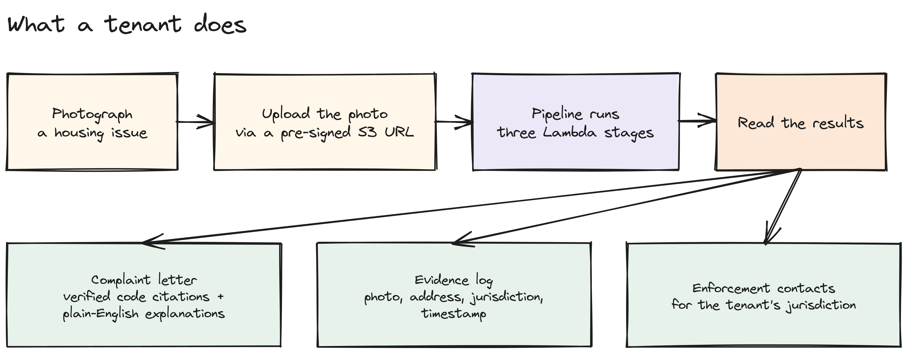
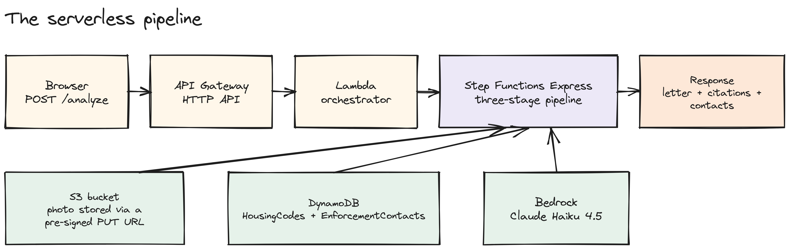
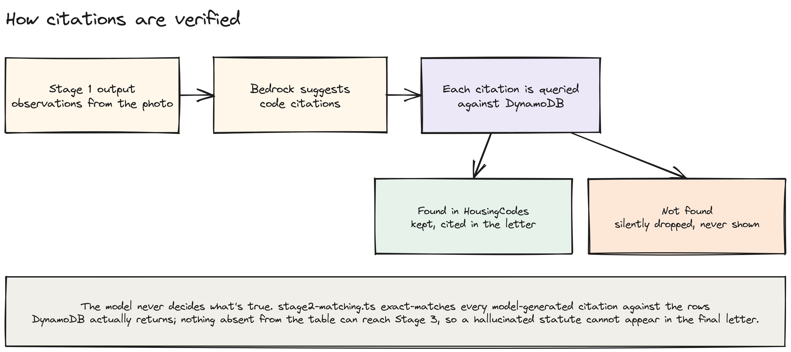

# Witness

**Upload a photo of a housing condition, get back a formal, statute-cited complaint letter.** Every citation in the letter is verified against a real database before it reaches the tenant, so the model can't invent a code section.

**Devpost: https://devpost.com/software/witness-f9ijzq** · Built at the AWS + Kiro Hackathon, Virginia Tech, Blacksburg VA, March 2026.

Deployed on AWS for the hackathon and since torn down; the Devpost page has the demo. To run it yourself, see [Run it locally](#run-it-locally).

## How it works







Editable sources for each picture are in [`docs/diagrams/`](docs/diagrams/). Open a `.excalidraw` file at excalidraw.com.

## What it does

- **Vision analysis.** A tenant uploads a photo through a pre-signed S3 URL. Stage 1 sends it to Bedrock Claude Haiku 4.5, which returns only what it physically sees (no diagnosis, no legal conclusion).
- **Citation verification.** Stage 2 asks Bedrock to suggest relevant Virginia housing code sections, then exact-matches every suggestion against the `HousingCodes` DynamoDB table. A citation absent from the table is silently discarded before it ever reaches the letter.
- **Letter generation.** Stage 3 looks up the tenant's jurisdiction in the `EnforcementContacts` table and has Bedrock draft a formal complaint letter with the verified citations, plain-English explanations, and local contacts attached.
- **Verified housing code base.** 30+ Virginia housing-code provisions seeded in DynamoDB, so the model is grounded against a real reference table instead of its own memory.

## Components

| Component | Job |
| --- | --- |
| **API Gateway** (HTTP API) | Single entry point: `POST /analyze`, `POST /get-upload-url` |
| **Lambda: get-upload-url** | Issues a pre-signed S3 PUT URL for the photo |
| **Lambda: orchestrator** | Parses the request and starts the Step Functions execution |
| **Lambda: stage1-vision** | Downloads the photo from S3, calls Bedrock vision, returns observations |
| **Lambda: stage2-matching** | Asks Bedrock for candidate code citations, verifies each against DynamoDB, drops unverified ones |
| **Lambda: stage3-complaint** | Looks up enforcement contacts, drafts the final letter with Bedrock |
| **Step Functions Express** | Runs the three stages in sequence with retry and error handling |
| **S3** | Stores the uploaded photo (pre-signed URL, 5-minute expiry, no server needed) |
| **DynamoDB** | `HousingCodes` (30+ provisions, owner-seeded) and `EnforcementContacts` tables |
| **IAM** | Least-privilege role per Lambda, scoped to only the S3/DynamoDB/Bedrock/Step Functions calls that Lambda makes |

## Built with

| Layer | What |
| --- | --- |
| Compute | AWS Lambda x5, Node.js 22, TypeScript |
| Orchestration | Step Functions Express, 3-stage pipeline |
| AI | Amazon Bedrock, Claude Haiku 4.5 (vision + text) |
| Storage | S3 (photos), DynamoDB (2 tables) |
| API | API Gateway HTTP API |
| Frontend | Static HTML/CSS/JS, no framework, no build step |

Estimated cost: under $0.01 per analysis (Bedrock ~$0.002, S3 + Step Functions ~$0.01 combined, Lambda/API Gateway/DynamoDB effectively free on the tiers used).

## Repo map

```
src/backend/lambdas/   the 5 Lambda handlers (orchestrator, get-upload-url, stage1-3)
src/backend/utils/     Bedrock client, DynamoDB client, CORS headers
src/backend/types/     shared TypeScript types
src/backend/scripts/   DynamoDB seed script
infra/                 Step Functions state machine definition
data/                  housing code + enforcement contact source JSON
frontend/              upload, loading, results pages (no build step)
docs/                  diagrams/ (this README's pictures)
```

## Run it locally

```bash
# Serve the frontend
cd frontend
node serve.mjs
# Open http://localhost:3000

# Rebuild backend after code changes
cd src/backend
npm install
npm run build

# Seed DynamoDB (requires AWS credentials)
export AWS_ACCESS_KEY_ID=<your-access-key-id>
export AWS_SECRET_ACCESS_KEY=<your-secret-access-key>
export AWS_DEFAULT_REGION=us-east-1
npx tsx scripts/seed-dynamodb.ts
```

## Team

Built by a 4-person team at the AWS + Kiro Hackathon, Virginia Tech, Blacksburg VA, March 2026.
